<div align="center">


### Building intelligent systems that are practical, reliable, and production-ready.

<a href="https://github.com/Aditya-k63"></a>
<a href="https://www.linkedin.com/in/aditya-kumar1407"></a>
<a href="mailto:adityakumar14072003@gmail.com"></a>

<br/><br/>


</div>

---

## About

I am a **B.Tech student specializing in AI & ML** who enjoys taking ideas from a model or algorithm and turning them into complete software systems.

My work sits at the intersection of **Generative AI, Retrieval-Augmented Generation, machine learning, backend engineering, and data-driven applications**. I focus on systems that are structured for evaluation, deployment, observability, and reliability.

### What I work on

- **Generative AI & RAG** — hybrid retrieval, GraphRAG, embeddings, reranking, evaluation, and LLM applications
- **AI Agents** — LangGraph workflows, tool calling, planning, memory, routing, and human-in-the-loop execution
- **ML Engineering** — NLP, forecasting, classification, feature engineering, model evaluation, and deployment
- **Backend Engineering** — FastAPI, REST APIs, PostgreSQL, Neo4j, authentication, caching, and service design
- **MLOps & DevOps** — Docker, CI/CD, reproducible benchmarks, monitoring, and production-oriented workflows

---

## Current Focus

<div align="center">

| Focus Area | What I am building |
|:---:|:---|
| **RAG Systems** | Hybrid vector + BM25 + graph retrieval with reranking and evaluation |
| **Agentic AI** | Stateful workflows with planning, tools, routing, and review loops |
| **AI Engineering** | FastAPI services around ML and LLM systems |
| **System Reliability** | Fallbacks, retries, caching, evaluation, and deterministic CI |

</div>

---

## Tech Stack

<div align="center">

### Languages


### AI / ML


### Backend & Data


### Tools & Infrastructure


### AI Ecosystem


</div>

---

## Selected Projects

### 01 · Hybrid GraphRAG System
**Production-oriented RAG architecture combining semantic, lexical, and graph retrieval.**

`PDF → Parsing → Semantic Chunking → Embeddings → PostgreSQL/pgvector + Neo4j → Query Classification → Vector/BM25/Graph Retrieval → RRF → Cross-Encoder Reranking → LLM Generation`

- Hybrid vector + BM25 + Neo4j graph retrieval
- Reciprocal Rank Fusion and cross-encoder reranking
- Query classification and retrieval-strategy routing
- RAGAS evaluation with deterministic fallback
- Authentication, rate limiting, caching, memory, and analytics
- Dockerized services and GitHub Actions CI/CD

→ **Repository:** [Hybrid-GraphRAG-System](https://github.com/Aditya-k63/Hybrid-GraphRAG-System)

### 02 · Task Planner Agent
**Agentic workflow for turning high-level goals into executable tasks.**

- LangGraph state-machine architecture
- Planning → execution → review → routing
- Tool registry, session state, retries, and human input

→ **Repository:** [-Task-Planner-Agent](https://github.com/Aditya-k63/-Task-Planner-Agent)

### 03 · STGCN Traffic Forecasting
**Spatio-temporal graph neural network for traffic forecasting across road sensors.**

- PyTorch STGCN architecture
- Graph convolution + temporal convolution
- FastAPI backend + Streamlit interface

→ **Repository:** [stgcn-traffic-forecasting](https://github.com/Aditya-k63/stgcn-traffic-forecasting)

### 04 · Customer Churn Prediction API
**End-to-end machine learning application with deployment and CI/CD.**

- Scikit-learn pipeline
- FastAPI inference service
- Streamlit frontend
- JWT authentication and Docker Compose

→ **Repository:** [churn-prediction-ml-api](https://github.com/Aditya-k63/churn-prediction-ml-api)

### 05 · RAG Assistant
**Document question-answering system using retrieval, reranking, and evaluation.**

- PDF ingestion and chunking
- Vector + BM25 retrieval
- RRF, cross-encoder reranking, memory, and RAGAS

→ **Repository:** [Rag](https://github.com/Aditya-k63/Rag)

---

## Open Source Contributions

I contribute to open-source projects by identifying concrete bugs, improving dataset metadata, adding regression coverage, and extending developer tooling.

### Microsoft MarkItDown — YAML Converter
**Pull Request #2472 · Open**

Added a YAML-to-Markdown converter supporting `.yaml` and `.yml` files, including nested mappings, lists, tables, multiple YAML documents, anchors/aliases, multiline strings, and edge cases. Added converter registration and comprehensive tests.

→ [View PR #2472](https://github.com/microsoft/markitdown/pull/2472)

### SignalFlow — FastAPI Route Fix
**Pull Request #14 · Merged**

Fixed a FastAPI route-ordering bug where `DELETE /api/executions/all` was being captured by the parameterized `DELETE /api/executions/{execution_id}` route. Added regression tests covering both bulk and single-execution deletion.

→ [View PR #14](https://github.com/scottcollier10/signalflow/pull/14)

### llmsectest — Secret Match Classification
**Pull Request #8 · Merged**

Improved secret-leak detection so exact-case and case-insensitive matches are distinguished, with regression tests for both behaviors.

→ [View PR #8](https://github.com/wehnsdaefflae/llmsectest/pull/8)

### Awesome Data — Dataset Metadata Maintenance

Contributed multiple fixes to `awesomedata/apd-core`, including:

- Updated the MIT Heart Rate Time Series dataset link to the PhysioNet archive. **PR #386 — merged**.
- Updated USDA Nutrient Database metadata to reflect FoodData Central. **PR #387 — merged**.
- Updated the CIMA histological microscopy dataset link to an accessible Kaggle mirror. **PR #388 — merged**.
- Fixed the Cell Image Library homepage URL and metadata. **PR #389 — merged**.

→ [View Awesome Data contributions](https://github.com/awesomedata/apd-core/pulls?q=is%3Apr+author%3AAditya-k63)

---

## Engineering Approach

```text
Problem → Data / Documents → Retrieval or ML Pipeline → Model / LLM
        → Evaluation → API / Product → Reliability → Deployment / CI/CD
```

**Retrieval quality · evaluation · latency · failure handling · security · reproducibility · deployment**

---

## AI / ML Areas

| Area | Technologies / Concepts |
|---|---|
| **Generative AI** | LLMs, prompt engineering, RAG, GraphRAG, tool calling |
| **Retrieval** | pgvector, BM25, graph retrieval, RRF, reranking |
| **Agents** | LangChain, LangGraph, stateful workflows, memory |
| **NLP** | TF-IDF, transformers, BERT, classification, semantic similarity |
| **Deep Learning** | PyTorch, TensorFlow, GNNs, STGCN, transfer learning |
| **Machine Learning** | XGBoost, Random Forest, Logistic Regression, SVM, clustering |
| **MLOps** | MLflow, Docker, GitHub Actions, evaluation pipelines |
| **Backend** | FastAPI, REST APIs, PostgreSQL, Neo4j, authentication |

---

## GitHub Activity

<div align="center">

<a href="https://github.com/Aditya-k63">
  
</a>
<a href="https://github.com/Aditya-k63">
  
</a>

<br/><br/>

### Contribution Activity


</div>

---

## Beyond Projects

- Data structures and algorithms
- SQL and data modeling
- System design for AI applications
- Prompt engineering and LLM evaluation
- Experimentation and model analysis
- Writing maintainable, testable Python

---

## Let's Connect

I am interested in opportunities and collaborations around **AI/ML engineering, Generative AI, RAG, intelligent agents, and backend systems**.

<div align="center">

<a href="https://www.linkedin.com/in/aditya-kumar1407">LinkedIn</a> •
<a href="https://github.com/Aditya-k63">GitHub</a> •
<a href="mailto:adityakumar14072003@gmail.com">Email</a>

<br/><br/>


</div>
